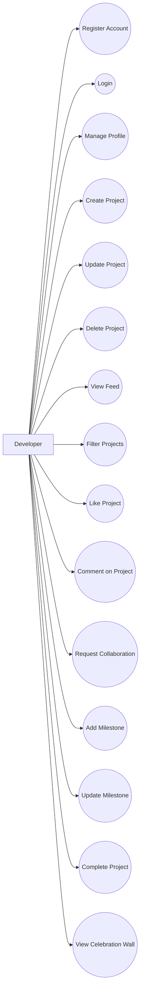
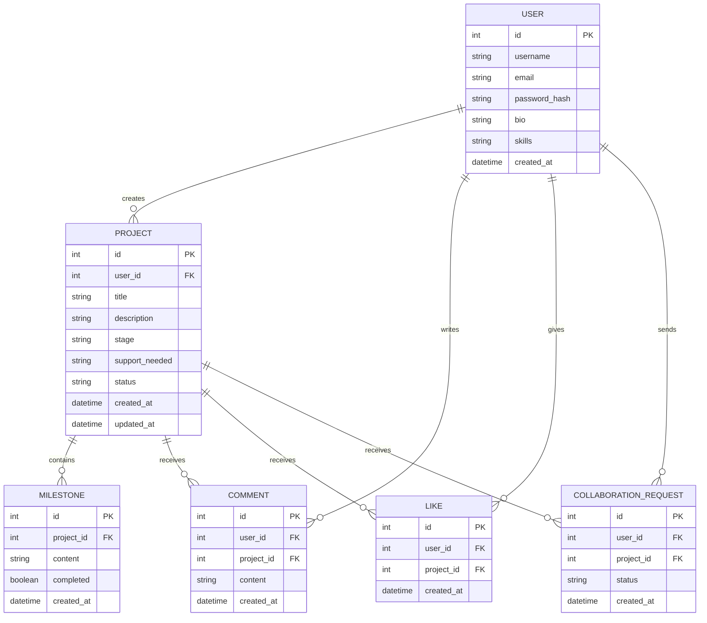
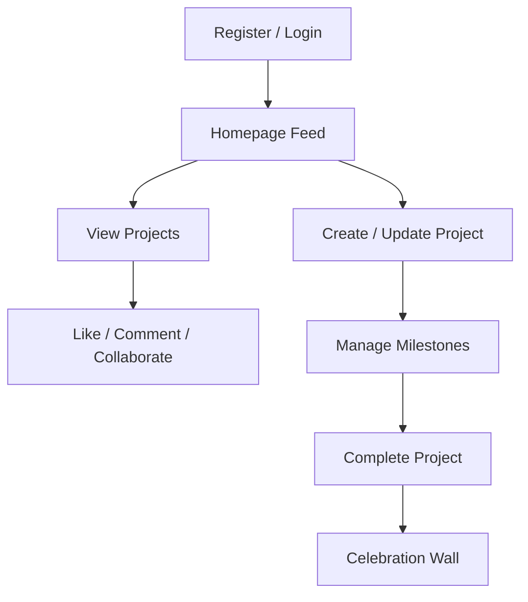

# MzansiBuilds

## Project Profiling

### 1. Introduction
MzansiBuilds is a web-based platform designed to enable developers to build publicly, share their progress, and engage with a community of other developers. The platform focuses on visibility, collaboration, and recognition by allowing users to showcase ongoing projects, track milestones, and celebrate completed work.

---

### 2. Problem Statement
Many developers build projects in isolation without visibility, feedback, or collaboration opportunities. This often limits growth, slows progress, and reduces motivation.

MzansiBuilds addresses this by providing a centralized platform where developers can:
- Share what they are building
- Track progress over time
- Interact with other developers
- Collaborate on projects
- Showcase completed work

---

### 3. Objectives
The main objectives of the system are:
- To enable developers to create and manage personal accounts
- To allow developers to share and update their projects
- To provide a live feed of ongoing projects
- To support interaction through comments, likes, and collaboration requests
- To track project progress using milestones
- To highlight completed projects in a Celebration Wall

---

### 4. System Overview
MzansiBuilds consists of a web application with a structured backend and an interactive frontend interface.

The system allows developers to:
- Register and log into the platform
- Create and manage projects
- View and interact with a live feed of projects
- Track project progress through milestones
- View completed projects in a dedicated Celebration Wall

---

### 5. Functional Requirements

#### 5.1 User Account Management
- The system shall allow users to register new accounts
- The system shall allow users to log in and log out securely
- The system shall allow users to update their profile information

#### 5.2 Project Management
- The system shall allow users to create new projects
- The system shall allow users to update project details (title, description, stage, support required)
- The system shall allow users to delete their own projects

#### 5.3 Project Feed
- The system shall display a feed of all projects
- The system shall allow sorting of projects by:
  - Latest
  - Most liked
  - Relevance

#### 5.4 Project Interaction
- The system shall allow users to like projects
- The system shall allow users to comment on projects
- The system shall allow users to request collaboration on projects

#### 5.5 Milestone Tracking
- The system shall allow users to add milestones to projects
- The system shall allow users to update milestone progress
- The system shall allow users to mark milestones as completed

#### 5.6 Celebration Wall
- The system shall display completed projects
- The system shall highlight developers who have completed their projects

---

### 6. Non-Functional Requirements

| Category       | Description |
|----------------|------------|
| Performance    | The system should provide fast response times for loading the project feed |
| Security       | User authentication must be secure with password hashing and protected routes |
| Usability      | The interface should be simple, clean, and easy to navigate |
| Maintainability| The system should follow a modular and scalable architecture |
| Scalability    | The system should support future enhancements such as recommendation systems |

---

### 7. System Architecture

The application follows a three-tier architecture:

- Frontend: User interface for interaction
- Backend: Handles business logic and API endpoints
- Database: Stores user, project, and interaction data

```
Frontend (UI) → Backend (Flask API) → Database (PostgreSQL)
```

---

### 8. Core Entities

The system is built around the following core entities:

- User: Represents a developer using the platform
- Project: Represents a project created by a user
- Milestone: Represents progress updates within a project
- Comment: Represents user interactions on projects
- CollaborationRequest: Represents a request to collaborate on a project

---

### 9. System Flow

The general flow of the system is as follows:

1. User registers or logs into the system
2. User is redirected to the homepage feed
3. User can view projects from other developers
4. User can interact with projects (like, comment, request collaboration)
5. User can create or update their own projects
6. User can add and manage milestones
7. Completed projects are automatically displayed in the Celebration Wall

---

### 10. Design Considerations

- A card-based layout is used for displaying projects for clarity and readability
- A sidebar is used to separate milestones and the Celebration Wall from the main feed
- Filtering options are included to improve user experience when navigating projects
- The design follows a green, white, and black theme for consistency

---

### 11. Assumptions and Constraints

- The primary users of the system are developers
- The application requires an internet connection
- The system is developed within a limited time frame, focusing on core functionality
- Advanced features such as real-time updates and machine learning are considered optional enhancements

---

### 12. Use Case Diagram



---

### Entity Relationship Diagram



#### ERD Justification
The ERD/Class Diagram models the core data entities and relationships required to support the MzansiBuilds platform. It defines the database structure based on the identified functional requirements and ensures a normalized, scalable data design.

##### User
Represents a registered developer on the platform and stores authentication and profile information.

##### Project
Represents a publicly shared project created by a developer.

##### Milestone
Represents progress checkpoints and updates within a project.

##### Comment
Represents discussion and feedback on projects.

##### Like
Represents engagement metrics used for popularity and feed sorting.

##### Collaboration Request
Represents a developer's request to collaborate on a project.

---

## System Flow



#### System Flow Justification
The System Flow Diagram illustrates the high-level navigation and interaction path of a developer within the platform. It demonstrates how users move through the core platform workflow from authentication to project completion.

## 🧰 Tech Stack

### Backend
- **Framework:** Flask (Python)
- **Architecture:** Application Factory Pattern with layered separation (routes, services, models)
- **Database:** PostgreSQL (production) / SQLite (development & testing)
- **ORM:** SQLAlchemy
- **Authentication:** JWT (flask‑jwt‑extended) + bcrypt password hashing
- **Testing:** pytest + pytest‑flask

### Frontend
- **Framework:** React 18 with Vite
- **Styling:** Tailwind CSS (custom green/black/white theme)
- **Animations:** Framer Motion
- **HTTP Client:** Axios with JWT interceptors
- **Routing:** React Router DOM
- **Notifications:** React Hot Toast

### DevOps & CI/CD
- **Version Control:** Git & GitHub
- **CI Pipeline:** GitHub Actions (runs pytest for backend and build verification for frontend on every push)

---

## 🚀 Getting Started

### Prerequisites
- Python 3.11+
- Node.js 20+
- PostgreSQL (optional for development; SQLite works out of the box)

### Backend Setup

```bash
cd backend
python -m venv venv
source venv/bin/activate      # On Windows: venv\Scripts\activate
pip install -r requirements.txt

# Create .env file from example
cp .env.example .env
# Edit .env with your secret keys and database URL

flask db upgrade               # Apply migrations
flask run
